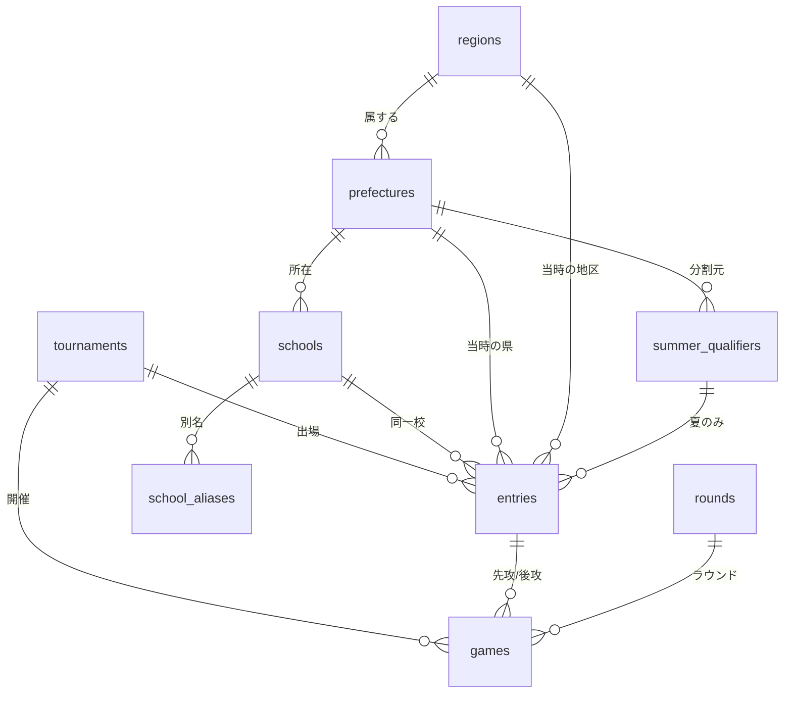

# 甲子園データベース 設計ドキュメント

対象: 春の選抜高等学校野球大会 / 夏の全国高等学校野球選手権大会
DBMS: PostgreSQL 15+ (Supabase)
データ取得: Web スクレイピング(後工程)

---

## 1. スコープと想定ユースケース

本DBは **甲子園本大会の試合結果** を格納し、以下のような集計に答えることを目的とする。

| # | 質問例 | 必要な軸 |
|---|--------|----------|
| Q1 | ここ10年で近畿勢への勝利数が一番多い学校は? | 年 × 相手の地区 × 勝敗 |
| Q2 | 長野県勢と滋賀県勢の通算対戦成績は? | 都道府県 × 都道府県 × 勝敗 |
| Q3 | 21世紀枠校の通算勝率は? | 選出区分 × 勝敗 |
| Q4 | 南北海道と北北海道、どちらが甲子園で勝っている? | 地方大会 × 勝敗 |
| Q5 | 準々決勝以降に強い地区は? | ラウンド × 地区 |

**スコープ外(現時点)**: 地方大会の試合結果、選手個人成績、イニングスコア。
いずれも `games` を親として子テーブルを足せば拡張可能(§8参照)。

---

## 2. 設計方針

### 2.1 春夏で代表の階層構造が異なる

ご指定の通り、階層は季節によって異なる。

```
夏: 代表校 ─ 地方大会(北北海道 / 宮城 / 南大阪 …) ─ 都道府県 ─ 地区(関東 / 近畿 …)
春: 代表校 ────────────────────────────────────── 都道府県 ─ 地区(関東 / 近畿 …)
```

- **地区(region)** は春夏共通のマスタ。すべての代表校が必ずいずれかの地区に属する。
- **地方大会(summer_qualifier)** は夏のみ。春の出場行では必ず NULL。
- この「夏なら必須 / 春なら NULL」を **アプリではなく DB の CHECK 制約で保証** する(§2.2)。
- 春の 21世紀枠は地区とは独立した **フラグ** (`is_21st_century`) として持つ。したがって21世紀枠校も通常通り地区に属する。

### 2.2 季節を出場行に非正規化し、複合外部キーで整合性を担保

CHECK 制約は他テーブルを参照できないため、「春の行かどうか」をチェックするには `entries` 自身に季節が必要になる。そこで `tournaments` に `UNIQUE (id, season)` を張り、`entries` から複合FKで参照することで、**非正規化した `season` が親と食い違わないことをDBが保証する**。

```sql
-- tournaments 側
unique (id, season)

-- entries 側
foreign key (tournament_id, season) references tournaments (id, season)

check (
  (season = 'summer' and summer_qualifier_id is not null) or
  (season = 'spring' and summer_qualifier_id is null)
)
check (season = 'spring' or is_21st_century = false)
```

同じ手法で `games` の2チームが**同一大会の出場校であること**も保証する
(`entries` に `UNIQUE (id, tournament_id)` を張り、`games` から複合FKで参照)。

### 2.3 「学校」と「出場」を分ける

校名変更(例: 明徳 → 明徳義塾)、統廃合、移転がある。

- `schools` … 学校の同一性を表すマスタ。`name` は**現校名**。
- `entries` … 大会 × 学校の1レコード。**当時の校名 `name_at_time`** と当時の都道府県・地区を保持。

これにより「長野県勢の通算成績」は当時の所属で正しく集計でき、「明徳義塾の通算成績」は `school_id` で名寄せして集計できる、という両立ができる。

### 2.4 地区は都道府県から一意に決まる。ただし出場行が優先

`prefectures.region_id` を正とする(1都道府県 = 1地区)。
一方 `entries.region_id` にも実値を持たせ、**例外年や独自定義があればそちらが優先**される設計とする。集計クエリは常に `entries.region_id` を見る。

地区マスタは選抜の選出地区に合わせ、**東京を関東から独立**させた10区分をシードとする。

| 地区 | 都道府県 |
|------|----------|
| 北海道 | 北海道 |
| 東北 | 青森 岩手 宮城 秋田 山形 福島 |
| 関東 | 茨城 栃木 群馬 埼玉 千葉 神奈川 山梨 |
| 東京 | 東京 |
| 北信越 | 新潟 富山 石川 福井 長野 |
| 東海 | 岐阜 静岡 愛知 三重 |
| 近畿 | 滋賀 京都 大阪 兵庫 奈良 和歌山 |
| 中国 | 鳥取 島根 岡山 広島 山口 |
| 四国 | 徳島 香川 愛媛 高知 |
| 九州 | 福岡 佐賀 長崎 熊本 大分 宮崎 鹿児島 沖縄 |

> **要確認**: 「近畿勢」に三重を含める流儀もある。含めたい場合は §8 の代替案を参照。

### 2.5 引き分け再試合を表現できるようにする

2006年夏決勝(早実 – 駒大苫小牧)のような引き分け再試合、および不戦勝・ノーゲームがある。

- `winner_entry_id` は **NULL 許容**(引き分け・未確定時 NULL)。
- `status` で `final` / `draw` / `forfeit` / `no_game` / `scheduled` を区別。
- **不戦勝(`forfeit`)は進出校を `winner_entry_id` に設定し、`score1 / score2` は NULL**
  (辞退校 = 敗者)。例: 2021夏はコロナ辞退で2試合が不戦勝になった。勝者を持つのは
  `final` と `forfeit` のみ(`draw` / `no_game` / `scheduled` は勝者 NULL)。
- 再試合は別行とし、`replay_seq`(0=初戦, 1=再試合)と `replay_of_game_id` で紐づける。
- ユニークキーに `replay_seq` を含めることで、同一カード同一ラウンドの再試合が重複と誤判定されない。

### 2.6 スクレイピング前提の作り

- 全テーブルに **自然キーの UNIQUE 制約** を張り、`INSERT … ON CONFLICT DO UPDATE` で**冪等な再取り込み**を可能にする。
- `school_aliases` で表記ゆれ・旧校名からの名寄せを行う(スクレイピングの最大の難所)。
- `source_url` / `scraped_at` を主要テーブルに持ち、出所を追跡可能にする。
- 生HTMLとパース前レコードは `staging` スキーマに退避し、本テーブルへは検証後に昇格させる。

---

## 3. ER 概略



---

## 4. テーブル定義

### 4.1 `regions` — 地区(春夏共通)

| カラム | 型 | 制約 | 説明 |
|--------|----|------|------|
| id | smallint | PK, identity | |
| name | text | NOT NULL, UNIQUE | 近畿, 関東, 東京 … |
| sort_order | smallint | NOT NULL | 北から順の表示順 |

### 4.2 `prefectures` — 都道府県

| カラム | 型 | 制約 | 説明 |
|--------|----|------|------|
| id | smallint | PK | JISコード 1–47 |
| name | text | NOT NULL, UNIQUE | 長野, 滋賀 …(「県」は付けない) |
| region_id | smallint | NOT NULL, FK→regions | 正となる地区対応 |

### 4.3 `summer_qualifiers` — 夏の地方大会(代表枠)

夏のみ使用。通常年49、記念大会では56等に増える。

| カラム | 型 | 制約 | 説明 |
|--------|----|------|------|
| id | smallint | PK, identity | |
| name | text | NOT NULL, UNIQUE | 北北海道, 西東京, 南大阪, 宮城 … |
| prefecture_id | smallint | FK→prefectures, NULL可 | 複数県にまたがる旧地方大会用にNULL可 |
| note | text | | 有効年など |

> 1県1代表化(1978年)以前は複数県にまたがる地方大会が存在する。その期間まで対象にする場合のみ `prefecture_id` を NULL とし、必要なら中間テーブルを追加する(§8)。

### 4.4 `schools` — 学校マスタ

| カラム | 型 | 制約 | 説明 |
|--------|----|------|------|
| id | integer | PK, identity | |
| name | text | NOT NULL | 現校名(廃校の場合は最終校名) |
| kana | text | | 読み |
| prefecture_id | smallint | NOT NULL, FK | 現在の所在地 |
| is_active | boolean | NOT NULL default true | 廃校フラグ |
| note | text | | |
| | | UNIQUE (name, prefecture_id) | 同名校が別県にある場合に対応 |

### 4.5 `school_aliases` — 校名の別名・旧称

スクレイピング時の名寄せ用。

| カラム | 型 | 制約 | 説明 |
|--------|----|------|------|
| id | integer | PK, identity | |
| school_id | integer | NOT NULL, FK→schools | |
| alias | text | NOT NULL | 明徳, 桐蔭學園, 大阪桐蔭高校 … |
| kind | text | CHECK | `former_name` / `notation` / `source_label` |
| | | UNIQUE (school_id, alias) | |

### 4.6 `tournaments` — 大会

| カラム | 型 | 制約 | 説明 |
|--------|----|------|------|
| id | smallint | PK, identity | |
| year | smallint | NOT NULL | 開催年 |
| season | season_type | NOT NULL | `spring` / `summer` |
| edition | smallint | | 第N回 |
| is_memorial | boolean | NOT NULL default false | 記念大会 |
| team_count | smallint | | 出場校数 |
| | | UNIQUE (year, season) | 自然キー |
| | | UNIQUE (id, season) | 子テーブルの複合FK用 |

### 4.7 `entries` — 出場(大会 × 学校) ★中核

| カラム | 型 | 制約 | 説明 |
|--------|----|------|------|
| id | integer | PK, identity | |
| tournament_id | smallint | NOT NULL, FK | |
| season | season_type | NOT NULL | 複合FKで親と一致を保証 |
| school_id | integer | NOT NULL, FK→schools | 名寄せ用の恒久ID |
| name_at_time | text | NOT NULL | 出場当時の校名 |
| prefecture_id | smallint | NOT NULL, FK | 当時の都道府県 |
| region_id | smallint | NOT NULL, FK | 当時の地区(集計はこれを使う) |
| summer_qualifier_id | smallint | FK, **夏のみ NOT NULL** | 地方大会 |
| is_21st_century | boolean | NOT NULL default false, **春のみ true 可** | 21世紀枠 |
| selection_note | text | | 神宮大会枠 / 補欠校繰上 等 |
| appearance_no | smallint | | 出場回数(春夏通算) |
| consecutive_no | smallint | | 連続出場回数 |
| source_url, scraped_at | | | 出所 |
| | | UNIQUE (tournament_id, school_id) | 自然キー |
| | | UNIQUE (id, tournament_id) | games の複合FK用 |
| | | 部分UNIQUE (tournament_id, summer_qualifier_id) | 1地方大会1代表 |

### 4.8 `rounds` — ラウンドマスタ

| code | label | sort_order |
|------|-------|-----------|
| r1 | 1回戦 | 1 |
| r2 | 2回戦 | 2 |
| r3 | 3回戦 | 3 |
| qf | 準々決勝 | 4 |
| sf | 準決勝 | 5 |
| f  | 決勝 | 6 |

### 4.9 `games` — 試合 ★中核

> **改訂(スクレイピング元調査を受けて)**: 当初は先攻/後攻を必須としていたが、取得元(Wikipedia)が保持するのは「勝利校・敗戦校・スコア」であり打順は原則不明であることが判明した。そのため掲載順の `entry1` / `entry2` を主とし、先攻は判明時のみ記録する構成に変更した。判明するのはサヨナラ勝ち(スコアの `x` 表記)のケースで、この場合は勝者が後攻と確定できる。

| カラム | 型 | 制約 | 説明 |
|--------|----|------|------|
| id | integer | PK, identity | |
| tournament_id | smallint | NOT NULL, FK | |
| round_code | text | NOT NULL, FK→rounds | |
| day_no / game_no | smallint | | 大会第N日・第M試合 |
| game_date | date | | |
| entry1_id | integer | NOT NULL, FK→entries | 掲載順の第1校(確定試合では勝利校) |
| entry2_id | integer | NOT NULL, FK→entries | 掲載順の第2校 |
| score1 / score2 | smallint | | 得点 |
| first_bat_entry_id | integer | FK→entries, NULL可 | 先攻(判明時のみ) |
| is_walkoff | boolean | NOT NULL default false | サヨナラ |
| pair_lo / pair_hi | integer | 生成列 | カードの向きに依存しない一意キー用 |
| innings | smallint | | 延長・コールド対応 |
| winner_entry_id | integer | FK→entries, NULL可 | final・forfeit は非NULL。NULL = 引き分け/未確定(draw/no_game/scheduled) |
| status | game_status | NOT NULL default 'final' | final / draw / forfeit / no_game / scheduled |
| replay_seq | smallint | NOT NULL default 0 | 0=初戦, 1=再試合 |
| replay_of_game_id | integer | FK→games | 再試合元 |
| source_url, scraped_at | | | |

主な制約:

```sql
check (entry1_id <> entry2_id)
check (winner_entry_id is null or winner_entry_id in (entry1_id, entry2_id))
-- 勝者を持つのは final と forfeit(不戦勝)。draw/no_game/scheduled は勝者なし。
check ((status in ('final','forfeit')     and winner_entry_id is not null)
       or (status not in ('final','forfeit') and winner_entry_id is null))
-- 不戦勝はスコアを持たない。
check (status <> 'forfeit' or (score1 is null and score2 is null))
unique (tournament_id, round_code, pair_lo, pair_hi, replay_seq)
foreign key (entry1_id, tournament_id) references entries (id, tournament_id)
foreign key (entry2_id, tournament_id) references entries (id, tournament_id)
```

---

## 5. ビュー

### 5.1 `v_game_teams` — 1試合を2行(チーム視点)に展開

対戦成績系クエリの土台。これがあると CASE 式が消えて集計が一気に書きやすくなる。

出力: `game_id, year, season, round_code, entry_id, school_id, prefecture_id, region_id, opponent_*, runs_for, runs_against, result('win'|'loss'|'draw'), is_first_bat`

`result` は `winner_entry_id` 比較で決まるため、不戦勝(`forfeit`)は進出校=`win`・
辞退校=`loss` として集計される(スコアは NULL)。

### 5.2 `v_entries_full`

`entries` に大会・学校・都道府県・地区・地方大会名を結合した平坦なビュー。BIツールからの利用を想定。

---

## 6. 想定質問に対するクエリ

### Q1. ここ10年で近畿勢への勝利数が最も多い学校

```sql
select s.name, count(*) as wins
from v_game_teams v
join schools s      on s.id = v.school_id
join regions  ro    on ro.id = v.opponent_region_id
where v.result = 'win'
  and ro.name = '近畿'
  and v.year >= extract(year from current_date) - 10
group by s.id, s.name
order by wins desc, s.name
limit 10;
```

### Q2. 長野県勢 vs 滋賀県勢の通算対戦成績

```sql
select
  count(*) filter (where v.result = 'win')  as nagano_wins,
  count(*) filter (where v.result = 'loss') as shiga_wins,
  count(*) filter (where v.result = 'draw') as draws
from v_game_teams v
join prefectures p  on p.id = v.prefecture_id
join prefectures op on op.id = v.opponent_prefecture_id
where p.name = '長野' and op.name = '滋賀';
```

### Q3. 21世紀枠の通算成績

```sql
select count(*) filter (where v.result='win') as wins,
       count(*) filter (where v.result='loss') as losses
from v_game_teams v
join entries e on e.id = v.entry_id
where e.is_21st_century;
```

### Q4. 夏の地方大会別 勝率ランキング

```sql
select q.name,
       count(*) filter (where v.result='win') as w,
       count(*) filter (where v.result='loss') as l,
       round(count(*) filter (where v.result='win')::numeric
             / nullif(count(*) filter (where v.result in ('win','loss')),0), 3) as pct
from v_game_teams v
join entries e on e.id = v.entry_id
join summer_qualifiers q on q.id = e.summer_qualifier_id
group by q.id, q.name
having count(*) >= 20
order by pct desc;
```

---

## 7. スクレイピング/取り込み設計

### 7.1 パイプライン

```
Web ──fetch──> staging.source_pages(生HTML + content_hash)
                     │ parse
                     ▼
              staging.stg_entries / staging.stg_games (文字列のまま)
                     │ 名寄せ・検証
                     ▼
              public.entries / public.games (UPSERT)
```

- `content_hash` を比較し、**ページが変わっていなければ再パースしない**。
- 昇格時に検証: 出場校数と大会規模の一致、各校の勝敗数合計と試合数の整合、決勝が1試合か、など。

### 7.2 名寄せ(最重要)

スクレイピング元の校名は「大阪桐蔭」「大阪桐蔭高」「大阪桐蔭高等学校」などブレる。

1. 正規化(全角/半角、旧字体、「高校」「高等学校」の除去、空白除去)
2. `schools.name` と `school_aliases.alias` の正規化済み値で完全一致
3. ヒットしない場合は **都道府県で絞ってから** 類似度(`pg_trgm`)で候補提示 → 人手確認 → `school_aliases` に登録

同名校が別県に存在するため、**必ず都道府県とセットで解決する**こと。

### 7.3 冪等な UPSERT 例

```sql
insert into games (tournament_id, round_code, first_bat_entry_id, second_bat_entry_id,
                   replay_seq, first_bat_score, second_bat_score, winner_entry_id, status)
values (:t, :r, :e1, :e2, :seq, :s1, :s2, :w, :st)
on conflict (tournament_id, round_code, first_bat_entry_id, second_bat_entry_id, replay_seq)
do update set first_bat_score = excluded.first_bat_score,
              second_bat_score = excluded.second_bat_score,
              winner_entry_id = excluded.winner_entry_id,
              status = excluded.status,
              updated_at = now();
```

### 7.4 Supabase 固有

- 全テーブルで **RLS を有効化**し、`anon` / `authenticated` には SELECT のみ許可。書き込みはスクレイパが `service_role` キーで実施。
- 名寄せ用に `pg_trgm` 拡張を有効化。
- `updated_at` はトリガで自動更新。
- 参照系がヘビーになったら `v_game_teams` を MATERIALIZED VIEW 化し、取り込みバッチ末尾で `REFRESH`。

---

## 8. 未決事項・拡張余地

| 項目 | 内容 | 対応案 |
|------|------|--------|
| 「近畿」の定義 | 三重を含む流儀がある | `region_groups` / `region_group_members` を追加し、集計用の別定義を持たせる。`entries.region_id` は変更しない |
| 東京の扱い | 春の選出地区に合わせ関東と分離した。夏の集計で関東に含めたい場合 | 上記 `region_groups` で「関東(東京含む)」を定義 |
| 1978年以前 | 複数県にまたがる地方大会 | `summer_qualifier_prefectures` 中間テーブルを追加 |
| 対象範囲 | 全年か直近N年か | 全年なら戦前の中等学校時代の校名・県境の扱いを別途要検討 |
| 選手・イニング | 現状スコープ外 | `game_innings(game_id, inning, top_bottom, runs)`、`players` / `game_player_stats` を `games` の子として追加 |
| 地方大会の試合結果 | 現状スコープ外 | `qualifier_games` を別テーブルで追加(甲子園本大会と混ぜない) |

---

## 9. 付属ファイル

- `supabase/migrations/20260813000001_init_schema.sql` — 上記を実装した DDL 一式(型・テーブル・制約・インデックス・ビュー・RLS)。
- `supabase/migrations/20260813000002_seed_master_data.sql` — マスタ(地区・都道府県・地方大会・ラウンド)のシード。
- 適用は `supabase db push`、もしくは Supabase の SQL Editor に番号順で貼り付けて実行する。
